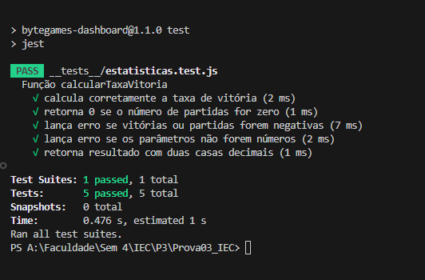
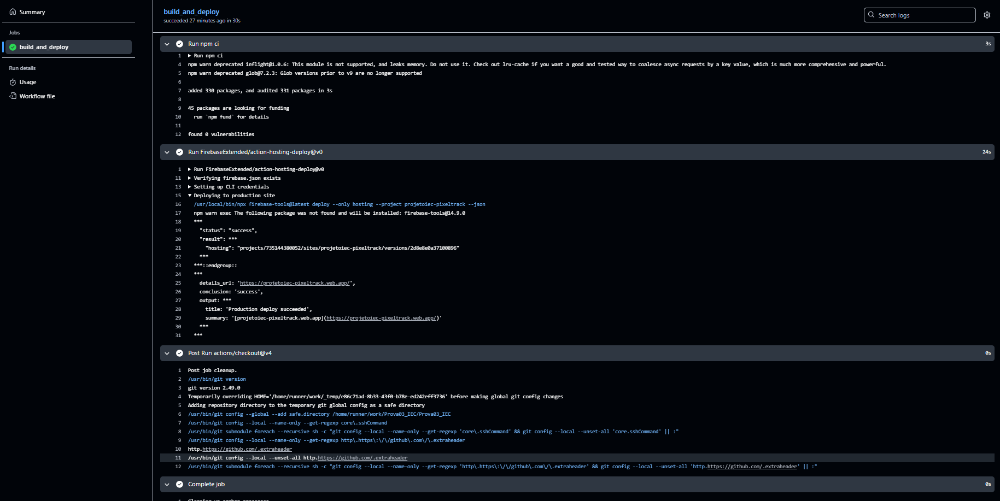

🎮 ByteGames - Painel Interativo de eSports
Projeto completo para um dashboard moderno focado em eSports, com CI/CD, deploy automático e monitoramento de qualidade!

🚀 Funcionalidades Principais
🔁 Conversão de pontos com lógica personalizada

🧪 Testes automatizados com Jest

⚙️ CI/CD com GitHub Actions

📈 Monitoramento com Prometheus, Grafana e Loki

📦 Deploy contínuo via Firebase Hosting

🧪 Mock de API local em JSON

🌱 Estrutura de Branches Git
mermaid
Copy
Edit
gitGraph
   commit id: "v1.0" tag: "main"
   branch dev
   commit id: "Commit inicial na dev"
   branch feature/tela-login
   commit id: "Início tela de login"
   commit id: "Finaliza layout login"
   checkout dev
   merge feature/tela-login tag: "Merge PR #1"
   branch feature/menu
   commit id: "Adiciona menu lateral"
   checkout dev
   merge feature/menu tag: "Merge PR #2"
   checkout main
   merge dev tag: "Release v1.1"
🔀 Padrão de Branches
Branch	Finalidade
main	Código de produção (estável)
dev	Integração contínua de features
feature/*	Novas funcionalidades
bugfix/*	Correções de bugs
hotfix/*	Correções urgentes em produção

✅ Fluxo de Git Recomendado
bash
Copy
Edit
# Criar nova feature
git checkout dev
git pull origin dev
git checkout -b feature/nome-da-feature

# Commit atômico
git add .
git commit -m "feat: adiciona botão de login"

# Rebase antes do PR
git fetch origin
git rebase origin/dev

# Merge para dev
# Crie PR da feature/* para dev

# Merge para produção
git checkout main
git pull origin main
git merge --no-ff dev
git push origin main

# Criar nova tag
git tag -a v1.1.0 -m "Release 1.1.0"
git push origin v1.1.0
🔒 Regras de Proteção de Branches (GitHub)
✅ Proteger main e dev

🚫 Bloquear push direto

✅ Requerer PRs com revisão

🔒 Bloquear force push

🧪 Testes Automatizados com CI
Exemplo no workflow .yml:

yaml
Copy
Edit
on:
  push:
    branches: [main, dev]

jobs:
  test:
    runs-on: ubuntu-latest
    steps:
      - uses: actions/checkout@v4
      - uses: actions/setup-node@v4
        with:
          node-version: 18
      - run: npm install
      - run: npm test
🔍 O que os testes cobrem?
Teste	Garantia
Cálculo correto	Taxas e pontos consistentes
Divisão por zero	App não quebra
Entradas inválidas	Respostas robustas
Tipagem errada	Falhas detectadas
Precisão decimal	Resultados formatados corretamente

🖼️ Exemplo de execução dos testes

---

🔧 Logging com Firebase
📥 Logs no código
js
Copy
Edit
console.log('[LOGIN_SUCESSO] Usuário ID: 123 logado.');
console.error('[LOGIN_FALHA] Email inválido ou senha incorreta.');
console.log(`[HTTP] GET /perfil - Status: 200`);
🔎 Acesso no Firebase Console
Vá em: Monitoring > Logs

Use filtros:

txt
Copy
Edit
severity="ERROR"
textPayload:"LOGIN_FALHA"
textPayload:"/pontuacao"
🌐 Deploy com Firebase Hosting
✅ Inicialização
bash
Copy
Edit
firebase login
firebase init hosting
# Escolha build/ ou dist/
🔧 Exemplo de firebase.json
json
Copy
Edit
{
  "hosting": {
    "public": "build",
    "ignore": ["firebase.json", "**/.*", "**/node_modules/**"],
    "rewrites": [
      { "source": "**", "destination": "/index.html" }
    ]
  }
}
🚀 Deploy Manual
bash
Copy
Edit
firebase serve     # Teste local
firebase deploy    # Enviar para produção
🤖 Deploy Automático com GitHub Actions
🔐 Criar token Firebase CLI
bash
Copy
Edit
firebase login:ci
Adicione como FIREBASE_TOKEN em:
GitHub > Settings > Secrets > Actions

🛠️ Workflow .github/workflows/firebase-hosting.yml
yaml
Copy
Edit
name: Deploy Firebase

on:
  push:
    branches: [main]

jobs:
  deploy:
    runs-on: ubuntu-latest
    steps:
      - uses: actions/checkout@v4
      - uses: actions/setup-node@v4
        with:
          node-version: 18
      - run: npm install
      - run: npm run build
      - run: |
          npm install -g firebase-tools
          firebase deploy --token ${{ secrets.FIREBASE_TOKEN }}
🔁 Rollback em Caso de Erro
Acesse o Firebase Hosting

Vá em Histórico de versões

Clique em "Restaurar esta versão"

📌 Boas Práticas de Publicação
Prática	Por quê
CI separado entre dev/main	Previne deploy de código inacabado
Build limpo antes do deploy	Garante consistência dos arquivos
Testar localmente com serve	Valida antes de subir
Rollback habilitado no console	Segurança em caso de falha
.env e node_modules ignorados	Evita vazamentos e peso desnecessário

📚 Resumo Final
bash
Copy
Edit
firebase login           # uma vez
firebase init hosting    # uma vez
firebase deploy          # manual
# GitHub Actions cuida dos próximos!